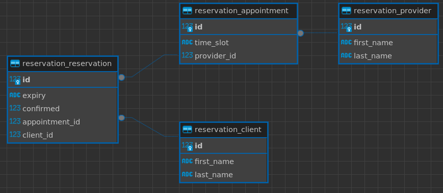

# ERD

* [appointment.py](appointment.py)
    - Transactional Data
    - uses a custom model manager to provide a convenience filter for [available appointments](appointment.py#L17) by filtering out all instances of [reservation](reservation.py#L30) that are either confirmed or not expired AND excludes appointments that are less than 24 hours from now
        * `ADVANCED_NOTICE` for filtering available appointments is configurable in [settings](../../settings/__init__.py#L81)
* [client.py](client.py)
    - Reference Data
* [provider.py](provider.py)
    - Reference Data
* [reservation.py](reservation.py)
    - Transactional Data
    - calculates expiration date at time of creation with an offset of 30 min
        * configurable in [settings](../../settings/__init__.py#L82)
    - uses a custom model manager to provide a convenience filter for [active reservations](reservation.py#15) by filtering out all instances whose expiration date has passed
